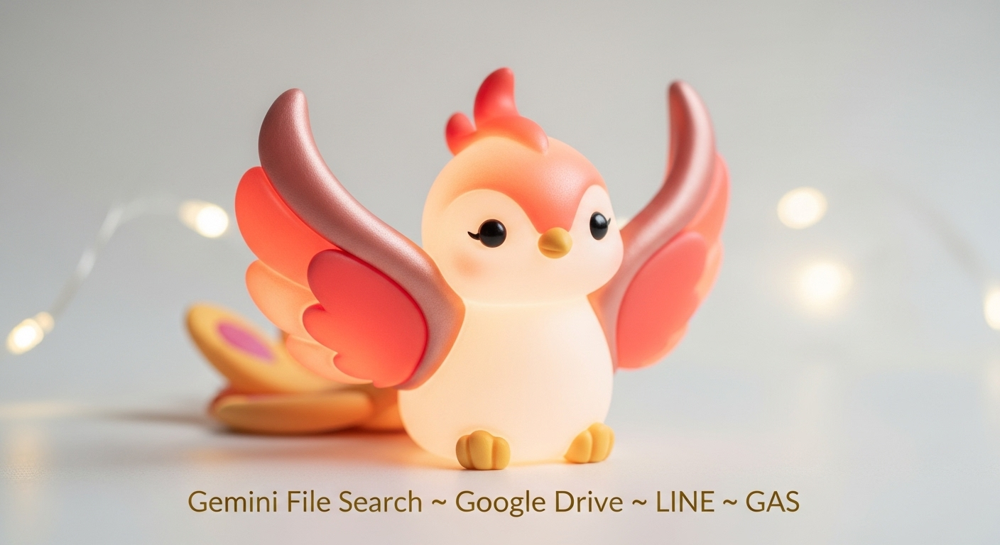

  

<h1 align="center">Gemini File Search × Google Drive × LINE × GAS</h1>

<em>Gemini と Google Drive を掛け合わせて、LINE から自然言語でファイル検索できるカスタムワークフロー。</em>

  
  
  
  

---

## 📚 Table of Contents
- [✨ Overview](#-overview)
- [🏗️ Architecture](#%EF%B8%8F-architecture)
- [⚙️ Installation](#%EF%B8%8F-installation)
- [🚀 Usage](#-usage)
- [🔐 Environment Variables](#-environment-variables)
- [🧪 Testing](#-testing)
- [📄 Documentation](#-documentation)
- [📸 Screenshots](#-screenshots)
- [🤝 Contributing](#-contributing)
- [📜 License](#-license)

## ✨ Overview
- LINE ボット経由で自然言語の検索リクエストを受け取り、Google Drive の対象フォルダを横断検索。
- Gemini API でユーザーの意図を解析し、Drive API の検索精度を向上。
- 結果のハイライトや共有リンクを整形し、LINE にレスポンスとして返却します。

## 🏗️ Architecture
プロジェクトの構成やデータフローは [`docs/ARCHITECTURE.md`](./docs/ARCHITECTURE.md) を参照してください。
簡易的な要約は以下の通りです：
- `code.gs` が Webhook のエントリポイントとなり、Gemini / Drive API を呼び出します。
- `appsscript.json` で Apps Script プロジェクトの権限やマニフェストを制御します。
- 各種 API キーやフォルダ ID は Apps Script のスクリプトプロパティで安全に管理します。

## ⚙️ Installation
1. Google Apps Script プロジェクトを新規作成し、`code.gs` と `appsscript.json` をアップロードします。
2. **サービスを追加** から Google Drive API を有効化します。
3. Google AI Studio で Gemini API キーを発行します。
4. LINE Developers コンソールで Messaging API チャネルを作成し、チャネルシークレット・チャネルアクセストークンを取得します。
5. Apps Script のスクリプトプロパティに下記のキーを登録します：
   - `LINE_CHANNEL_SECRET`
   - `LINE_CHANNEL_TOKEN`
   - `GEMINI_API_KEY`
   - `TARGET_DRIVE_FOLDER_ID`

## 🚀 Usage
1. Apps Script の「デプロイ」>「新しいデプロイ」から **ウェブアプリ** として公開します。
2. デプロイ時のアクセス権は「全員（匿名ユーザー含む）」または、必要に応じた権限に設定します。
3. 発行された Webhook URL を LINE Developers コンソールに登録します。
4. LINE でボットを友だち追加し、検索キーワードを送信すると Drive からの結果が返ってきます。
5. Gemini のプロンプトを調整する場合は `code.gs` の `buildPrompt()` 関数 (例) を編集します。

## 🔐 Environment Variables
- `.env` ファイルは使用せず、Apps Script の **スクリプトプロパティ** で環境変数を管理します。
- 秘密情報をコードにハードコーディングしないようにしてください。
- 必要なキー一覧は [`docs/WORKFLOWS.md`](./docs/WORKFLOWS.md#-%E6%9C%AC%E7%95%AA%E3%83%AA%E3%83%AA%E3%83%BC%E3%82%B9%E6%89%8B%E9%A0%86) も参照できます。

## 🧪 Testing
- Apps Script 上で `doPost` をモックするテスト関数を用意し、Gemini からのレスポンスと Drive 検索の組み合わせを検証します。
- LINE Messaging API シミュレータを使用すると、Webhook 全体を通したハッピーパスの確認が容易になります。
- Rate limit に達しないよう、Drive API の呼び出し回数をログでモニタリングしてください。

## 📄 Documentation
- システム構成: [`docs/ARCHITECTURE.md`](./docs/ARCHITECTURE.md)
- 運用ワークフロー: [`docs/WORKFLOWS.md`](./docs/WORKFLOWS.md)
- Issues テンプレートなど追加ドキュメントは今後整備予定です。必要に応じて `docs/` フォルダに追記してください。

## 📸 Screenshots

  
  
<em>プロジェクトのトーン&マナーを表すヘッダーイメージ</em>

## 🤝 Contributing
1. 新しいブランチを作成してください。
2. 変更内容を説明する Issue / Pull Request を作成し、`docs/` フォルダのドキュメント更新も忘れずに行います。
3. テストと lint を実行し、結果を PR に記載します。

## 📜 License
このリポジトリのライセンスは未指定です。プロジェクトに合わせて OSS ライセンスの追加を検討してください。
